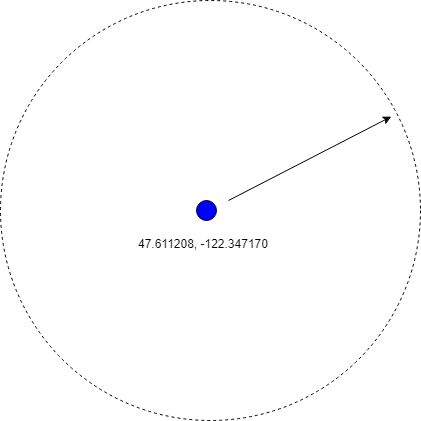
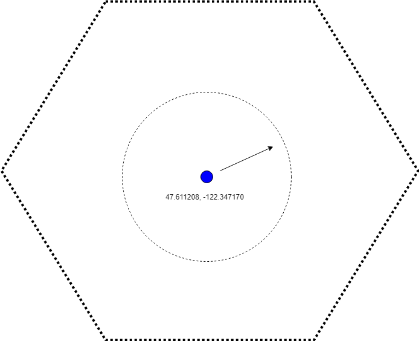

## Building Intelligent GeoSpatial Search Applications with Azure Search

### About this Presentation
Geo-spatial search is prevalent in everyday applications that power our day-to-day lives. In this presentation, you will learn how to use Azure-Search to power geospatial search application. This is a hands-on demo during which you will learn how to do the following operations described below using Postman and then later on walk through an end-to-end multi-tier application that integrates an Angular Web Application, a set of Azure Functions with an Azure Search backend to demonstrate the full range of geospatial capabilities of Azure Search:

### Goals
- Create/Update an Index
- List all Indicies within the Service
- Remove an Index
- Load Geospatial Records into an Azure Search Index
- Query for Records within and outside of a specific radius
- Query for Records within and outside of a specific polygon
- Query for Records within a specific distance inside and outside a pre-defined polygon

#### Searching by radius from a specific point

#### Searching by Geospatial fences and closed boundaries

### Use Cases and Industry Application
During the demo, we will cover some real-world use cases where the geospatial capabilities of Azure Search could come in pretty handy such as locating restaurants, tracking of important assets such as cruise ships in the sea, aircrafts, moving trucks and inventory at construction sites.
